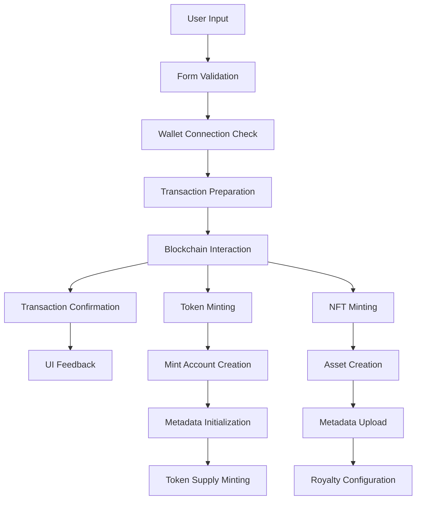

# 🔧 Technical Implementation Guide: Token & NFT Minting

> **Repository**: [https://github.com/gorblin-gabana/token-minter](https://github.com/gorblin-gabana/token-minter)  
> **Project**: Gorbagana Token LaunchPad - Token Minting Frontend For Gorbchain

## Table of Contents
1. [Architecture Overview](#architecture-overview)
2. [Token Minting Deep Dive](#token-minting-deep-dive)
3. [NFT Minting Implementation](#nft-minting-implementation)
4. [Transaction Strategies](#transaction-strategies)
5. [Error Handling & Recovery](#error-handling--recovery)
6. [Performance Optimizations](#performance-optimizations)
7. [Security Considerations](#security-considerations)
8. [Testing & Debugging](#testing--debugging)

---

## Architecture Overview

### High-Level Flow


### Core Components

#### 1. **Connection Management**
```typescript
// lib/utils.ts
export const GORB_CONNECTION = new Connection(
  process.env.NEXT_PUBLIC_GORB_RPC_URL || "https://rpc.gorbchain.xyz",
  {
    commitment: "confirmed",
    confirmTransactionInitialTimeout: 60000,
    wsEndpoint: process.env.NEXT_PUBLIC_GORB_WSS_URL || "wss://rpc.gorbchain.xyz/ws/",
  }
);
```

#### 2. **Program Constants**
```typescript
// Gorbchain-specific program IDs
const TOKEN22_PROGRAM = new PublicKey("FGyzDo6bhE7gFmSYymmFnJ3SZZu3xWGBA7sNHXR7QQsn");
const ASSOCIATED_TOKEN_PROGRAM = new PublicKey("4YpYoLVTQ8bxcne9GneN85RUXeN7pqGTwgPcY71ZL5gX");
const CUSTOM_MPL_CORE_PROGRAM = "BvoSmPBF6mBRxBMY9FPguw1zUoUg3xrc5CaWf7y5ACkc";
```

---

## Token Minting Deep Dive

### Step 1: Preparation Phase

#### Account Size Calculation
```typescript
function calculateMintAccountSize(extensions: ExtensionType[]): number {
  const baseSize = MINT_SIZE; // 82 bytes
  const extensionSize = extensions.reduce((acc, ext) => {
    switch (ext) {
      case ExtensionType.MetadataPointer:
        return acc + 32; // Metadata pointer size
      default:
        return acc;
    }
  }, 0);
  return baseSize + extensionSize;
}
```

#### Rent Calculation
```typescript
async function calculateRentRequirement(
  connection: Connection,
  size: number
): Promise<number> {
  const rentExemption = await connection.getMinimumBalanceForRentExemption(size);
  const buffer = Math.ceil(rentExemption * 0.1); // 10% buffer
  return rentExemption + buffer;
}
```

### Step 2: Mint Account Creation

#### Account Creation Transaction
```typescript
async function createMintAccount(
  connection: Connection,
  payer: PublicKey,
  mint: PublicKey,
  mintKeypair: Keypair,
  decimals: number
): Promise<Transaction> {
  const extensions = [ExtensionType.MetadataPointer];
  const mintLen = getMintLen(extensions);
  const rentExemption = await connection.getMinimumBalanceForRentExemption(mintLen);
  
  const transaction = new Transaction();
  
  // 1. Create the mint account
  transaction.add(
    SystemProgram.createAccount({
      fromPubkey: payer,
      newAccountPubkey: mint,
      lamports: rentExemption,
      space: mintLen,
      programId: TOKEN22_PROGRAM,
    })
  );
  
  // 2. Initialize metadata pointer
  transaction.add(
    createInitializeMetadataPointerInstruction(
      mint,
      payer,
      mint,
      TOKEN22_PROGRAM
    )
  );
  
  // 3. Initialize mint
  transaction.add(
    createInitializeMintInstruction(
      mint,
      decimals,
      payer,
      payer,
      TOKEN22_PROGRAM
    )
  );
  
  return transaction;
}
```

### Step 3: Metadata Implementation

#### Dynamic Metadata Space Calculation
```typescript
interface TokenMetadata {
  name: string;
  symbol: string;
  uri: string;
  additionalMetadata?: Array<[string, string]>;
}

function calculateMetadataSpace(metadata: TokenMetadata): number {
  const baseFields = {
    updateAuthority: 32,
    mint: 32,
    name: 4 + metadata.name.length,
    symbol: 4 + metadata.symbol.length,
    uri: 4 + metadata.uri.length,
    additionalMetadata: 4 + (metadata.additionalMetadata?.length || 0) * 8
  };
  
  const totalSize = Object.values(baseFields).reduce((a, b) => a + b, 0);
  const tlvOverhead = 4; // Type-Length-Value overhead
  const padding = Math.ceil(totalSize * 0.1); // 10% padding
  
  return totalSize + tlvOverhead + padding;
}
```

#### Metadata Initialization
```typescript
async function initializeMetadata(
  connection: Connection,
  payer: PublicKey,
  mint: PublicKey,
  metadata: TokenMetadata,
  wallet: any
): Promise<string> {
  // Calculate space needed
  const metadataSpace = calculateMetadataSpace(metadata);
  
  // Get current account info
  const accountInfo = await connection.getAccountInfo(mint);
  if (!accountInfo) {
    throw new Error("Mint account not found");
  }
  
  // Calculate additional rent needed
  const currentSize = accountInfo.data.length;
  const newSize = currentSize + metadataSpace;
  const additionalRent = await calculateAdditionalRent(connection, currentSize, newSize);
  
  const transaction = new Transaction();
  
  // Transfer additional rent if needed
  if (additionalRent > 0) {
    transaction.add(
      SystemProgram.transfer({
        fromPubkey: payer,
        toPubkey: mint,
        lamports: additionalRent,
      })
    );
  }
  
  // Initialize metadata
  transaction.add(
    createInitializeInstruction({
      programId: TOKEN22_PROGRAM,
      metadata: mint,
      updateAuthority: payer,
      mint: mint,
      mintAuthority: payer,
      name: metadata.name,
      symbol: metadata.symbol,
      uri: metadata.uri,
    })
  );
  
  return await sendAndConfirmTransaction(connection, transaction, wallet);
}
```

### Step 4: Token Supply Minting

#### Associated Token Account Creation
```typescript
async function createAssociatedTokenAccount(
  connection: Connection,
  payer: PublicKey,
  mint: PublicKey,
  owner: PublicKey
): Promise<{transaction: Transaction, associatedToken: PublicKey}> {
  const associatedToken = getAssociatedTokenAddressSync(
    mint,
    owner,
    false,
    TOKEN22_PROGRAM,
    ASSOCIATED_TOKEN_PROGRAM
  );
  
  const transaction = new Transaction();
  
  // Check if ATA already exists
  const accountInfo = await connection.getAccountInfo(associatedToken);
  if (!accountInfo) {
    transaction.add(
      createAssociatedTokenAccountInstruction(
        payer,
        associatedToken,
        owner,
        mint,
        TOKEN22_PROGRAM,
        ASSOCIATED_TOKEN_PROGRAM
      )
    );
  }
  
  return { transaction, associatedToken };
}
```

#### Token Minting
```typescript
async function mintTokens(
  connection: Connection,
  payer: PublicKey,
  mint: PublicKey,
  destination: PublicKey,
  amount: number,
  decimals: number
): Promise<Transaction> {
  const transaction = new Transaction();
  
  // Calculate actual amount with decimals
  const mintAmount = BigInt(amount) * BigInt(10 ** decimals);
  
  transaction.add(
    createMintToInstruction(
      mint,
      destination,
      payer,
      mintAmount,
      [],
      TOKEN22_PROGRAM
    )
  );
  
  return transaction;
}
```

---

## NFT Minting Implementation

### Metaplex Core Integration

#### UMI Context Setup
```typescript
import { createUmi } from "@metaplex-foundation/umi-bundle-defaults";
import { mplCore } from "@metaplex-foundation/mpl-core";
import { walletAdapterIdentity } from "@metaplex-foundation/umi-signer-wallet-adapters";

async function setupUmiContext(wallet: any): Promise<Umi> {
  const umi = createUmi(GORBCHAIN_RPC)
    .use(mplCore())
    .use(walletAdapterIdentity(wallet));
  
  // Set custom program ID if needed
  if (CUSTOM_MPL_CORE_PROGRAM) {
    umi.programs.add({
      name: "mplCore",
      publicKey: publicKey(CUSTOM_MPL_CORE_PROGRAM),
      getErrorFromCode: () => null,
      getErrorFromName: () => null,
    });
  }
  
  return umi;
}
```

#### Asset Creation with Plugins
```typescript
interface NFTCreationParams {
  name: string;
  uri: string;
  description: string;
  royaltyBasisPoints?: number;
  creators?: Array<{address: string; percentage: number}>;
}

async function createNFTAsset(
  umi: Umi,
  params: NFTCreationParams
): Promise<{signature: string; assetAddress: string}> {
  const assetSigner = generateSigner(umi);
  
  const plugins = [];
  
  // Add royalty plugin if specified
  if (params.royaltyBasisPoints) {
    plugins.push({
      type: "Royalties",
      basisPoints: params.royaltyBasisPoints,
      creators: params.creators || [{
        address: umi.identity.publicKey,
        percentage: 100,
      }],
      ruleSet: ruleSet("None"),
    });
  }
  
  // Add metadata plugin for description
  plugins.push({
    type: "Attributes",
    attributeList: [
      {
        key: "description",
        value: params.description,
      },
    ],
  });
  
  const result = await createV1(umi, {
    asset: assetSigner,
    name: params.name,
    uri: params.uri,
    plugins,
  }).sendAndConfirm(umi);
  
  return {
    signature: bs58.encode(result.signature),
    assetAddress: assetSigner.publicKey.toString(),
  };
}
```

### Metadata Standards Compliance

#### JSON Metadata Structure
```typescript
interface NFTMetadata {
  name: string;
  description: string;
  image: string;
  external_url?: string;
  attributes?: Array<{
    trait_type: string;
    value: string | number;
    display_type?: string;
  }>;
  properties?: {
    creators?: Array<{
      address: string;
      share: number;
    }>;
    category?: string;
    files?: Array<{
      uri: string;
      type: string;
    }>;
  };
}

function validateNFTMetadata(metadata: NFTMetadata): boolean {
  // Required fields
  if (!metadata.name || !metadata.description || !metadata.image) {
    return false;
  }
  
  // Validate attributes structure
  if (metadata.attributes) {
    for (const attr of metadata.attributes) {
      if (!attr.trait_type || attr.value === undefined) {
        return false;
      }
    }
  }
  
  // Validate creators
  if (metadata.properties?.creators) {
    const totalShare = metadata.properties.creators.reduce(
      (sum, creator) => sum + creator.share,
      0
    );
    if (totalShare !== 100) {
      return false;
    }
  }
  
  return true;
}
```

---

## Transaction Strategies

### Two-Transaction Approach (Recommended)

#### Transaction 1: Setup
```typescript
async function executeSetupTransaction(
  connection: Connection,
  wallet: any,
  mint: PublicKey,
  mintKeypair: Keypair,
  decimals: number
): Promise<string> {
  const transaction = await createMintAccount(
    connection,
    wallet.publicKey,
    mint,
    mintKeypair,
    decimals
  );
  
  // Set recent blockhash
  const { blockhash } = await connection.getLatestBlockhash();
  transaction.recentBlockhash = blockhash;
  transaction.feePayer = wallet.publicKey;
  
  // Sign with mint keypair
  transaction.partialSign(mintKeypair);
  
  // Sign with wallet
  const signedTransaction = await wallet.signTransaction(transaction);
  
  // Send transaction
  const signature = await connection.sendRawTransaction(
    signedTransaction.serialize(),
    { skipPreflight: false, preflightCommitment: "confirmed" }
  );
  
  // Confirm transaction
  await connection.confirmTransaction(signature, "confirmed");
  
  return signature;
}
```

#### Transaction 2: Minting
```typescript
async function executeMintingTransaction(
  connection: Connection,
  wallet: any,
  mint: PublicKey,
  metadata: TokenMetadata,
  supply: number,
  decimals: number
): Promise<string> {
  const transaction = new Transaction();
  
  // Initialize metadata
  const metadataIx = await createMetadataInstruction(
    mint,
    wallet.publicKey,
    metadata
  );
  transaction.add(metadataIx);
  
  // Create associated token account
  const { transaction: ataTransaction, associatedToken } = 
    await createAssociatedTokenAccount(
      connection,
      wallet.publicKey,
      mint,
      wallet.publicKey
    );
  transaction.add(...ataTransaction.instructions);
  
  // Mint tokens
  const mintTransaction = await mintTokens(
    connection,
    wallet.publicKey,
    mint,
    associatedToken,
    supply,
    decimals
  );
  transaction.add(...mintTransaction.instructions);
  
  return await sendAndConfirmTransaction(connection, transaction, wallet);
}
```

### Single Transaction Approach

#### Combined Transaction
```typescript
async function executeSingleTransaction(
  connection: Connection,
  wallet: any,
  params: TokenCreationParams
): Promise<string> {
  const mintKeypair = Keypair.generate();
  const mint = mintKeypair.publicKey;
  
  const transaction = new Transaction();
  
  // Add all instructions
  const setupTx = await createMintAccount(connection, wallet.publicKey, mint, mintKeypair, params.decimals);
  transaction.add(...setupTx.instructions);
  
  const metadataIx = await createMetadataInstruction(mint, wallet.publicKey, params);
  transaction.add(metadataIx);
  
  const { transaction: ataTransaction, associatedToken } = 
    await createAssociatedTokenAccount(connection, wallet.publicKey, mint, wallet.publicKey);
  transaction.add(...ataTransaction.instructions);
  
  const mintTx = await mintTokens(connection, wallet.publicKey, mint, associatedToken, params.supply, params.decimals);
  transaction.add(...mintTx.instructions);
  
  // Set transaction parameters
  const { blockhash } = await connection.getLatestBlockhash();
  transaction.recentBlockhash = blockhash;
  transaction.feePayer = wallet.publicKey;
  
  // Sign with mint keypair
  transaction.partialSign(mintKeypair);
  
  // Sign with wallet
  const signedTransaction = await wallet.signTransaction(transaction);
  
  // Send transaction
  const signature = await connection.sendRawTransaction(
    signedTransaction.serialize(),
    { skipPreflight: false, preflightCommitment: "confirmed" }
  );
  
  await connection.confirmTransaction(signature, "confirmed");
  
  return signature;
}
```

---

## Error Handling & Recovery

### Common Error Scenarios

#### 1. Insufficient Balance
```typescript
async function checkSufficientBalance(
  connection: Connection,
  payer: PublicKey,
  estimatedCost: number
): Promise<void> {
  const balance = await connection.getBalance(payer);
  const requiredBalance = estimatedCost + 5000000; // 0.005 SOL buffer
  
  if (balance < requiredBalance) {
    throw new Error(
      `Insufficient balance. Required: ${requiredBalance / 1e9} SOL, ` +
      `Available: ${balance / 1e9} SOL`
    );
  }
}
```

#### 2. Transaction Simulation
```typescript
async function simulateTransaction(
  connection: Connection,
  transaction: Transaction
): Promise<void> {
  const simulation = await connection.simulateTransaction(transaction);
  
  if (simulation.value.err) {
    const logs = simulation.value.logs?.join('\n') || 'No logs available';
    throw new Error(`Transaction simulation failed: ${logs}`);
  }
  
  console.log('Transaction simulation successful');
  console.log('Compute units consumed:', simulation.value.unitsConsumed);
}
```

#### 3. Retry Logic
```typescript
async function sendTransactionWithRetry(
  connection: Connection,
  transaction: Transaction,
  wallet: any,
  maxRetries: number = 3
): Promise<string> {
  for (let attempt = 1; attempt <= maxRetries; attempt++) {
    try {
      // Get fresh blockhash
      const { blockhash } = await connection.getLatestBlockhash();
      transaction.recentBlockhash = blockhash;
      
      // Simulate transaction
      await simulateTransaction(connection, transaction);
      
      // Sign and send
      const signedTransaction = await wallet.signTransaction(transaction);
      const signature = await connection.sendRawTransaction(
        signedTransaction.serialize(),
        { skipPreflight: false }
      );
      
      // Confirm transaction
      await connection.confirmTransaction(signature, "confirmed");
      
      return signature;
    } catch (error) {
      console.error(`Attempt ${attempt} failed:`, error);
      
      if (attempt === maxRetries) {
        throw error;
      }
      
      // Wait before retry
      await new Promise(resolve => setTimeout(resolve, 1000 * attempt));
    }
  }
  
  throw new Error('Max retries reached');
}
```

---

## Performance Optimizations

### Parallel Processing
```typescript
async function batchProcessingExample(
  connection: Connection,
  operations: Array<() => Promise<any>>
): Promise<any[]> {
  // Process operations in parallel with concurrency limit
  const CONCURRENCY_LIMIT = 5;
  const results = [];
  
  for (let i = 0; i < operations.length; i += CONCURRENCY_LIMIT) {
    const batch = operations.slice(i, i + CONCURRENCY_LIMIT);
    const batchResults = await Promise.all(batch.map(op => op()));
    results.push(...batchResults);
  }
  
  return results;
}
```

### Connection Pooling
```typescript
class ConnectionPool {
  private connections: Connection[] = [];
  private currentIndex = 0;
  
  constructor(endpoints: string[], poolSize: number = 3) {
    for (let i = 0; i < poolSize; i++) {
      endpoints.forEach(endpoint => {
        this.connections.push(new Connection(endpoint, "confirmed"));
      });
    }
  }
  
  getConnection(): Connection {
    const connection = this.connections[this.currentIndex];
    this.currentIndex = (this.currentIndex + 1) % this.connections.length;
    return connection;
  }
}
```

### Caching Strategy
```typescript
interface CacheEntry<T> {
  data: T;
  timestamp: number;
  ttl: number;
}

class MetadataCache {
  private cache = new Map<string, CacheEntry<any>>();
  
  set<T>(key: string, data: T, ttl: number = 60000): void {
    this.cache.set(key, {
      data,
      timestamp: Date.now(),
      ttl
    });
  }
  
  get<T>(key: string): T | null {
    const entry = this.cache.get(key);
    if (!entry) return null;
    
    if (Date.now() - entry.timestamp > entry.ttl) {
      this.cache.delete(key);
      return null;
    }
    
    return entry.data;
  }
}
```

---

## Security Considerations

### Input Validation
```typescript
function validateTokenParameters(params: TokenCreationParams): void {
  // Name validation
  if (!params.name || params.name.length > 32) {
    throw new Error("Token name must be 1-32 characters");
  }
  
  // Symbol validation
  if (!params.symbol || params.symbol.length > 10) {
    throw new Error("Token symbol must be 1-10 characters");
  }
  
  // Supply validation
  if (params.supply <= 0 || params.supply > 1e15) {
    throw new Error("Token supply must be between 1 and 1e15");
  }
  
  // Decimals validation
  if (params.decimals < 0 || params.decimals > 9) {
    throw new Error("Decimals must be between 0 and 9");
  }
  
  // URI validation
  if (params.uri && !isValidUrl(params.uri)) {
    throw new Error("Invalid URI format");
  }
}
```

### Transaction Signing Security
```typescript
async function secureTransactionSigning(
  transaction: Transaction,
  wallet: any
): Promise<Transaction> {
  // Verify wallet is connected
  if (!wallet.connected || !wallet.publicKey) {
    throw new Error("Wallet not connected");
  }
  
  // Verify transaction fee payer
  if (!transaction.feePayer?.equals(wallet.publicKey)) {
    throw new Error("Transaction fee payer mismatch");
  }
  
  // Verify transaction instructions
  const dangerousInstructions = [
    'CloseAccount',
    'Transfer',
    'InitializeAccount'
  ];
  
  for (const ix of transaction.instructions) {
    // Add instruction validation logic
    console.log('Validating instruction:', ix.programId.toString());
  }
  
  return await wallet.signTransaction(transaction);
}
```

---

## Testing & Debugging

### Unit Tests
```typescript
describe('Token Minting', () => {
  it('should calculate metadata space correctly', () => {
    const metadata = {
      name: 'Test Token',
      symbol: 'TEST',
      uri: 'https://example.com/metadata.json'
    };
    
    const space = calculateMetadataSpace(metadata);
    expect(space).toBeGreaterThan(0);
    expect(space).toBeLessThan(1000);
  });
  
  it('should validate token parameters', () => {
    const invalidParams = {
      name: '',
      symbol: 'TOOLONGNAME',
      supply: -1,
      decimals: 20
    };
    
    expect(() => validateTokenParameters(invalidParams)).toThrow();
  });
});
```

### Integration Tests
```typescript
describe('Token Creation Integration', () => {
  it('should create token end-to-end', async () => {
    const mockWallet = createMockWallet();
    const mockConnection = createMockConnection();
    
    const params = {
      name: 'Test Token',
      symbol: 'TEST',
      supply: 1000000,
      decimals: 6,
      uri: 'https://example.com/metadata.json'
    };
    
    const result = await mintGorbTokenTwoTx({
      connection: mockConnection,
      wallet: mockWallet,
      ...params
    });
    
    expect(result.signature).toBeDefined();
    expect(result.tokenAddress).toBeDefined();
  });
});
```

### Debug Utilities
```typescript
function debugTransaction(transaction: Transaction): void {
  console.log('Transaction Debug Info:');
  console.log('- Instructions:', transaction.instructions.length);
  console.log('- Fee Payer:', transaction.feePayer?.toString());
  console.log('- Recent Blockhash:', transaction.recentBlockhash);
  
  transaction.instructions.forEach((ix, index) => {
    console.log(`- Instruction ${index}:`, {
      programId: ix.programId.toString(),
      keys: ix.keys.length,
      dataLength: ix.data.length
    });
  });
}
```

---

## Monitoring & Analytics

### Transaction Monitoring
```typescript
interface TransactionMetrics {
  signature: string;
  status: 'pending' | 'confirmed' | 'failed';
  timestamp: number;
  confirmationTime?: number;
  error?: string;
}

class TransactionMonitor {
  private metrics: TransactionMetrics[] = [];
  
  async trackTransaction(
    connection: Connection,
    signature: string
  ): Promise<TransactionMetrics> {
    const metric: TransactionMetrics = {
      signature,
      status: 'pending',
      timestamp: Date.now()
    };
    
    this.metrics.push(metric);
    
    try {
      await connection.confirmTransaction(signature, 'confirmed');
      metric.status = 'confirmed';
      metric.confirmationTime = Date.now() - metric.timestamp;
    } catch (error) {
      metric.status = 'failed';
      metric.error = error instanceof Error ? error.message : 'Unknown error';
    }
    
    return metric;
  }
  
  getMetrics(): TransactionMetrics[] {
    return this.metrics;
  }
}
```

This comprehensive technical guide covers all aspects of the token and NFT minting implementation, from basic setup to advanced optimization techniques. Use it as a reference for understanding the codebase and implementing similar functionality. 